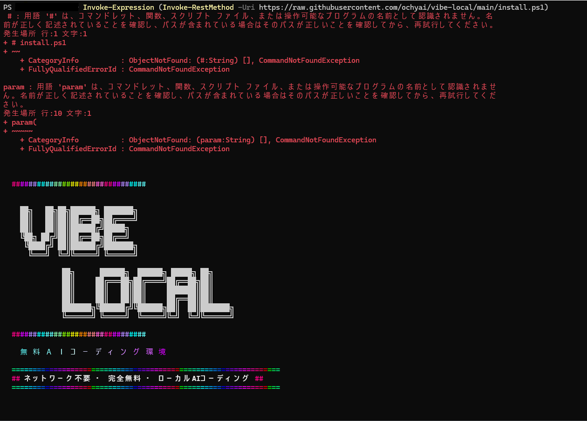
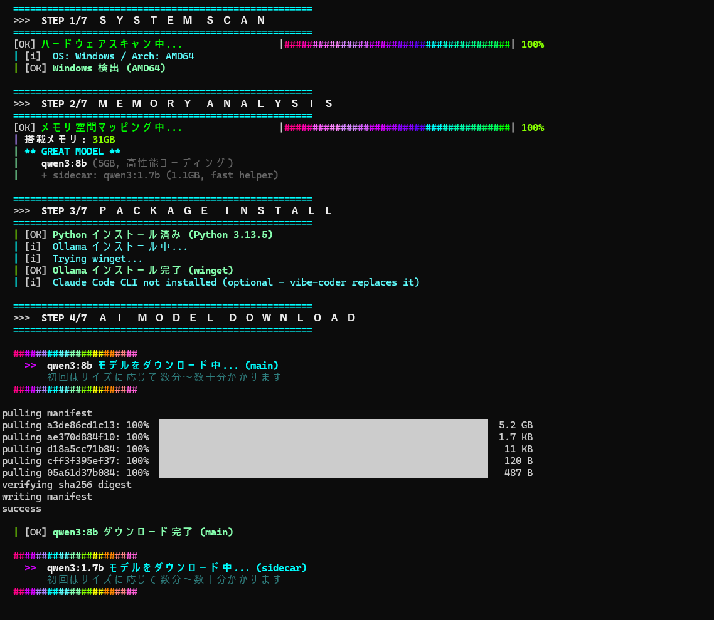
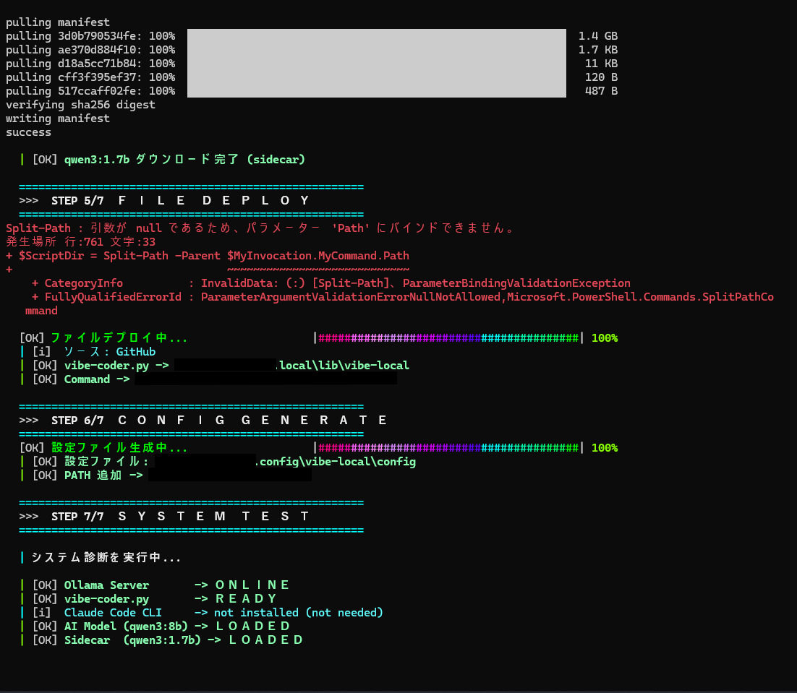
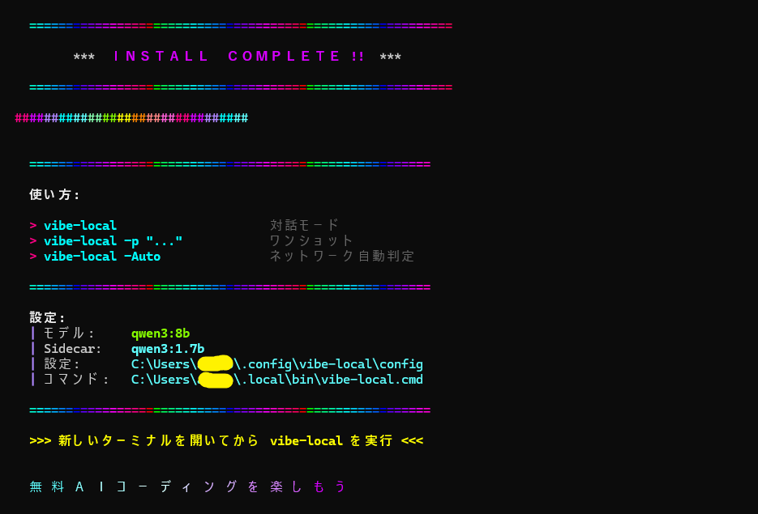
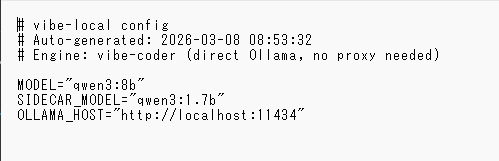
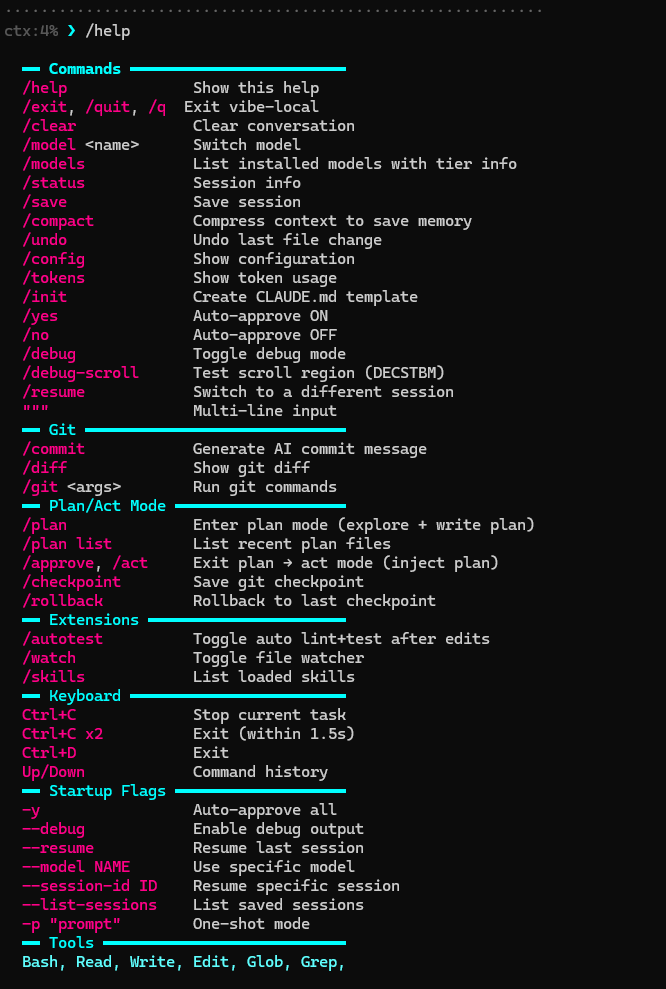
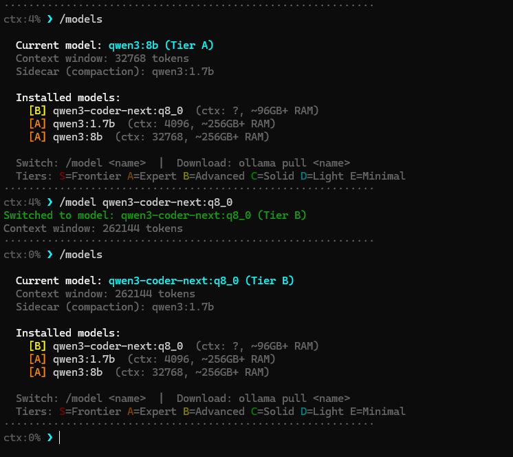

# はじめに
## 前提
- Windows環境
- NVIDIA GeForce RTX 4070 SUPER
- ClaudeCodeの使用経験なし

## この記事で得られること
- Windows環境でvibe-localをインストール

::: message alert
この記事自体は主に人間が執筆・構成しています。
ただし、添削や推敲にAIを利用しています。
:::

# 本題
## vibe-localとは
落合陽一氏によって作成されたMITライセンスのオープンソースライブラリです。
ローカルで起動するClaudeCodeライクなライブラリとして作成されています。
OllamaというローカルLLMのためのライブラリに依存していて初回インストール後は完全ローカルでのAIエージェントコーディングが実行可能になります。（まだ未検証です）

## 使い方
### インストール
インストール方法は丁寧に公式に記載されているので公式を見てください。
インストール時の画像だけ貼っておきます。

[vibe-localのREADME](https://github.com/ochyai/vibe-local?tab=readme-ov-file#%E6%97%A5%E6%9C%AC%E8%AA%9E--%E3%82%84%E3%81%95%E3%81%97%E3%81%84%E6%97%A5%E6%9C%AC%E8%AA%9E--english--%E4%B8%AD%E6%96%87)






初期ダウンロードされるのは「Qwen3:8b」、軽量作業で動くのが「Qwen3:1.7b」、Ollamaが起動しているところがおそらくHOSTのところになります。


インストール後にOllamaが同時に起動されます。


### コマンド一覧


``` sh
# CLAUDE.mdが生成されるあたりClaudeCodeライクな部分なんですかね。

/init
```

``` sh
# モデルの変更を行う。
# モデルのインストールは別口
# ollama pull <model名> 
# model名の部分は下記のOllamaのモデル名一覧から確認可能

/model <name>
```

### 起動
CLIでClaudeCodeライクに起動するなら以下のようにします。

``` sh
# 以下で起動できます。
vibe-local

# 起動時に注意がでます。
# 内容はすべての処理を許可するかどうかといったものです。
# デフォルトはNoになっているので基本はそのままEnterでOK
```


[Ollamaのモデル一覧](https://ollama.com/search)

8b や 1.7b は、モデルが学習したパラメータ数（規模）の目安だと考えて大きく外れていないはずです。実際には異なりますが、数字が大きい方が賢いっちゃ賢い。ただし、要求スペックが上がります。

モデル名の qX… のような表記は量子化されていて軽量・高速化しているモデルということと思われます。Qiitaで解説している記事を見かけたんですがリンクコピーするの忘れてました。

READMEで推奨されている組み合わせではないのでこの辺りは自己責任になります。

qwen3-coder-next:q8_0を ollama pull でインストールしてmodelを切り替えた例

``` sh
# LLMのインストール
ollama pull qwen3-coder-next:q8_0

# vibe-localの起動
vibe-local

# 現在Ollamaにインストールされているモデル一覧
/models

# モデルの切り替え
/model qwen3-coder-next:q8_0
```



LLMのインストールはちょっとかかりますので注意。

# まとめ
X上では、ClaudeCodeにClaudeCodeを作るように指示した結果できたものをベースにしているというお話でした。
もちろんそれだけで出来上がるものではなく、落合さんの知見あってこそのものなのでしょうけれども作ろうと思えて、お金（Max の月額上限でおよそ月3万円程度？）さえあれば既存サービスは作成できる未来が未来でなくなっていることがよくわかる例と思いました。
とりあえず使ってみて続きがあれば別で作るか、ここに追記します。

ご意見、ご感想などありましたらよろしくお願いします。

※所属企業とは一切関係なく個人の活動です。